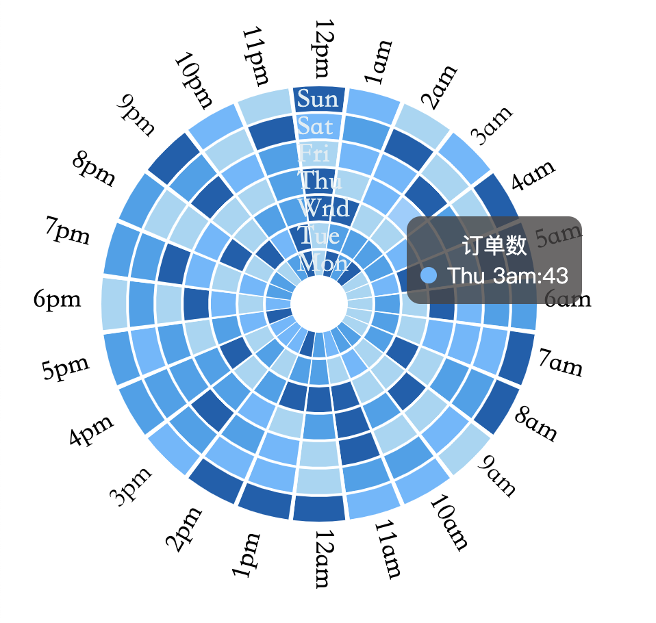

# 扇形时间热力图



[codePen](https://codepen.io/yukinotech/pen/eYOEJGy)查看动态效果

## 快速开始
html中导入
```html
<script src="hotMap.js"></script>
<canvas id="timePie"></canvas>
```
js中使用
```js
let canvas = document.getElementById('timePie')
let timePieInst = new timePie(canvas)
timePieInst.init()
```

## 销毁实例
```js
timePieInst.destroy()
```

## 配置选项
```js
new timePie(canvas,option)
```

### option的默认值
不传option时，option取默认值，传参数时，会把传入的参数覆盖到默认参数上。
```js
let option = {
    week: [ 'Sun', 'Sat', 'Fri', 'Thu', 'Wnd', 'Tue', 'Mon' ],
    hours :[
      '6am','7am', '8am', '9am','10am','11am','12am', 
      '1pm', '2pm', '3pm', '4pm', '5pm',
      '6pm', '7pm', '8pm', '9pm', '10pm', '11pm','12pm', 
      '1am', '2am', '3am', '4am', '5am', 
    ],
    card:{
      title:'标题',
      inner:function(value,week,hours){
        return `${week} ${hours}:${value}`
      },
      isShowColorSpan:true
    },
    judgeColor:function(value) {
      if (value > 75) {
        return 'rgb(1,94,176)'
      } else if (value <= 75 && value > 50) {
        return 'rgb(51,160,236)'
      } else if (value <= 50 && value > 25) {
        return 'rgb(96,183,293)'
      } else if (value <= 25 && value >= 0) {
        return 'rgb(159,214,244)'
      }
    },
    radius:90,
    layerWidth:12,
    lineWidth:10,
    fontSize:12,
    horizontalFontOffset:{
      xOffset:0,
      yOffset:3,
    },
    leftRoundFontOffset:{
      xOffset:0,
      yOffset:3,
    },
    rightRoundFontOffset:{
      xOffset:10,
      yOffset:3,
    },
    timeMap:(function(){
      let timeMap = []
      for (let j = 0; j < 7; j++) {
        let newItem = []
        for (let i = 0; i < 24; i++) {
          newItem.push(Math.random() * 100)
        }
        timeMap.push(newItem)
      }
      return timeMap
    })()
  }
```

#### hours
hours为length为24的数组，显示为小时，数组的第一项为3点钟位置，然后顺时针转一圈。

#### week
week为length为7的数组，显示为星期，数组第一项为最上面，依次向下。

#### timeMap
数据，格式为2维数组，第1层长度是7，为星期，第2层长度是24，为小时。

顺序和week参数，hours参数相对应。

#### card为显示数据的悬浮窗

##### card.title
card.title为card的标题

##### card.inner
card.inner必须为一个函数，hotMap提供3个参数，分别是card的当前值value，当前hover的星期week，当前hover的小时hour。函数的返回值是card的内容

##### card.isShowColorSpan
决定card中颜色小球是否显示

#### radius
radius为热力图圆形最远处半径

#### layerWidth
层间距

#### lineWidth
层厚度

#### fontSize
文本字体大小

#### horizontalFontOffset
调整星期文字的偏移量

#### leftRoundFontOffset和rightRoundFontOffset
调整小时文字的偏移量，小时文字分2部分绘制，因此分别调节